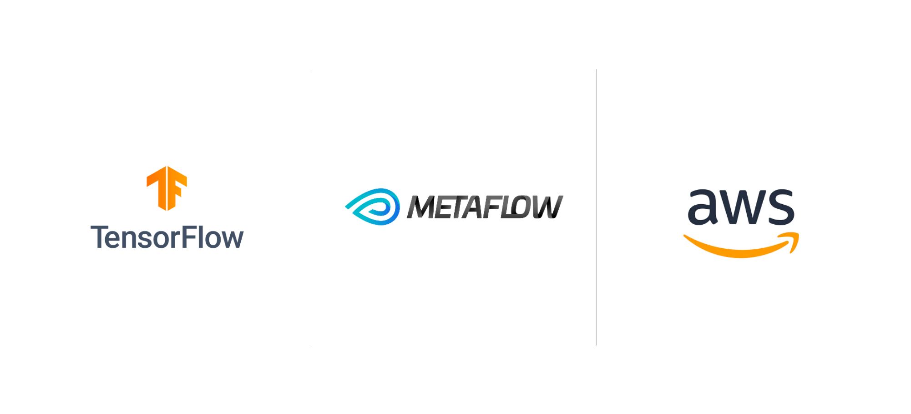

# textflow

Training pipelines in Natural Language Processing with [TensorFlow](https://www.tensorflow.org/), [Metaflow](https://metaflow.org/) and [Amazon Web Services](https://aws.amazon.com/fr/).

## Models
Pre-training
  * [Distributed Representations of Words and Phrases and their Compositionality](https://arxiv.org/pdf/1310.4546.pdf)
  
Text classification
  * [Hierarchical Attention Networks for Document Classification](https://www.cs.cmu.edu/~./hovy/papers/16HLT-hierarchical-attention-networks.pdf)

Neural Machine Translation
  * [Neural Machine Translation by Jointly Learning to Align and Translate](https://arxiv.org/pdf/1409.0473.pdf)
  * [Effective Approaches to Attention-based Neural Machine Translation](https://arxiv.org/pdf/1508.04025.pdf)
  * [Attention Is All You Need](https://arxiv.org/pdf/1706.03762.pdf)

## License
This project is under the MIT License.